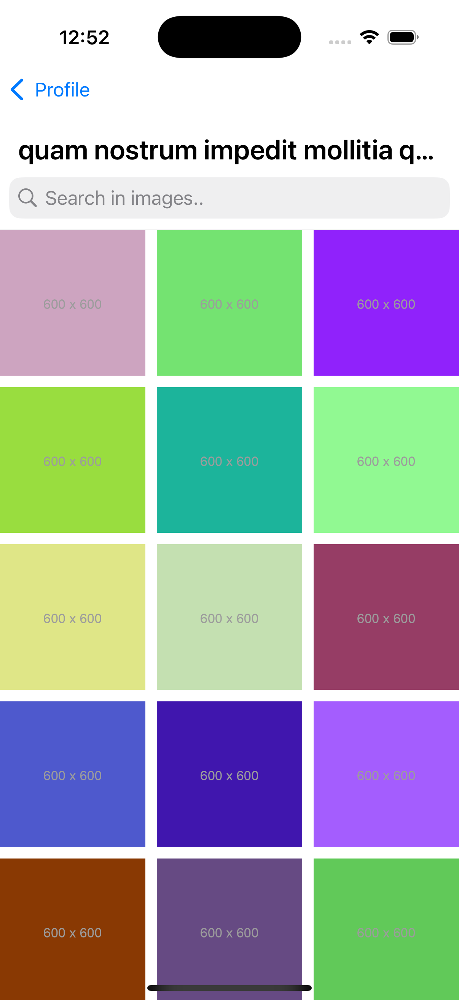

# Bosta-iOS-task

This is a simple iOS app built using Swift, UIKit, MVVM architecture, Combine, Moya, and other libraries to display user albums and their photos. The app fetches data from the [JSONPlaceholder API](https://jsonplaceholder.typicode.com), and allows users to view albums, explore photo details, and search for images by title. It also includes a bonus feature of viewing images with zooming and sharing functionalities.

## Features
- Fetch user albums by user ID and display them in a list.
- View album details by navigating to the album photos screen.
- Search for images within an album by title.
- Zoom in and share images in a separate image viewer screen.

## Technologies Used
- UIKit
- MVVM Architecture
- Combine
- Moya

## Usage
To run the project, clone the repository and open it using Xcode. Ensure you have the necessary dependencies installed using Swift Package Manager.

## Contributing
Contributions are welcome! If you encounter any issues or have suggestions for improvements, please open an issue or submit a pull request.

## License
This project is licensed under the [MIT License](LICENSE).
